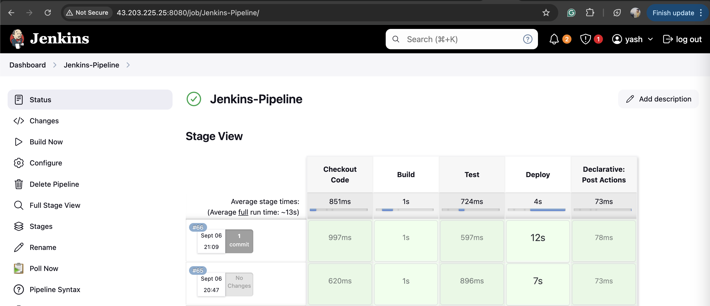
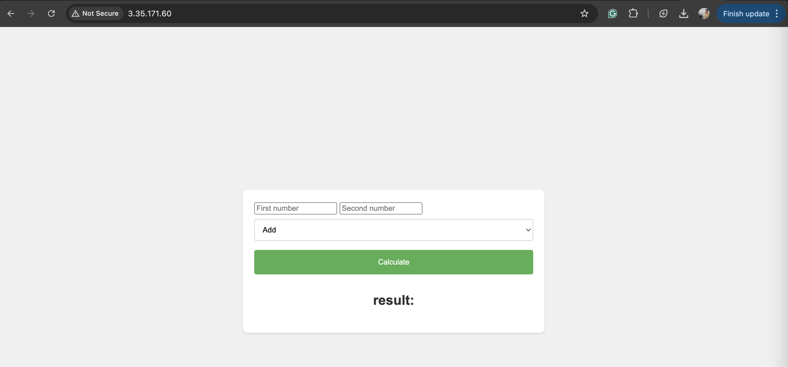

# Jenkins Pipeline

## Objective
To set up a Jenkins pipeline that automates the testing and deployment of a simple Python web application.

## Concepts/Technology/Tool Covered
1. Git & GitHub for Version Control.
2. Jenkins for developing pipeline.
3. Python for developing simple Flask App.
4. AWS EC2.

## Steps
1. Install Jenkins on a cloud server(EC2 Server) following the [Jenkins Installation Document](https://www.jenkins.io/doc/book/installing/)
2. If everything is successful you can check Jenkins is running on port 8080. Open the port and you can access it.
> _note:- make sure inbound port 8080 is allowed._
3. Make sure the below packages were installed on the Instance where Jenkins is installed.
> sudo apt install python3-flask
> sudo apt install python3-pytest
> sudo apt install python3-pip
4. Create a new pipeline project from Jenkins dashboard and choose pipeline script.
5. Make sure SSH Agent plugin is installed in Jenkins.
6. Copy paste the code from **Jenkinsfile** in the pipeline script.
7. Configure the secrets in Jenkins having SSH key for the server where the Application needs to deploy and made the necessary change in pipeline(jenkinsfile) for the same.
8. File with name **default** is present in the directory for configuring reverse proxy using nginx.
9. The pipeline will trigger everytime when there is push on jenkins branch and deploy the application following building and testing of the application.
10. Make sure **pre-script.sh** and **post-script.sh** have the executable permission on the server wherever the application needs to deploy for the first time and for later on the scripts will handle this.
11. Lookout for success logs in [**ConsoleOutput.txt**](./images/ConsoleOutput.txt) for the pipeline.
12. Jenkins Dashboard or our pipeline looks like this.

13. Application after deploying to the server looks like.

## References & Links

## Happy Coding
Thanks for continuing till the End. :)