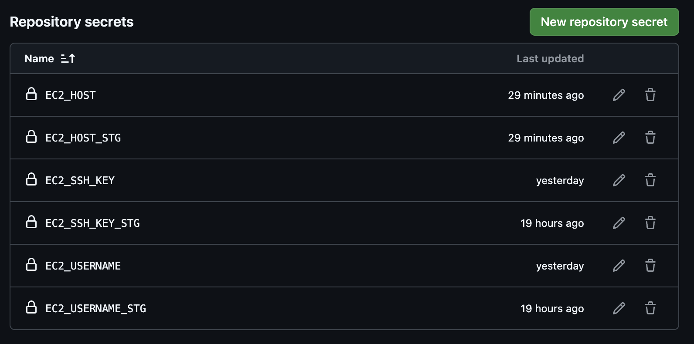
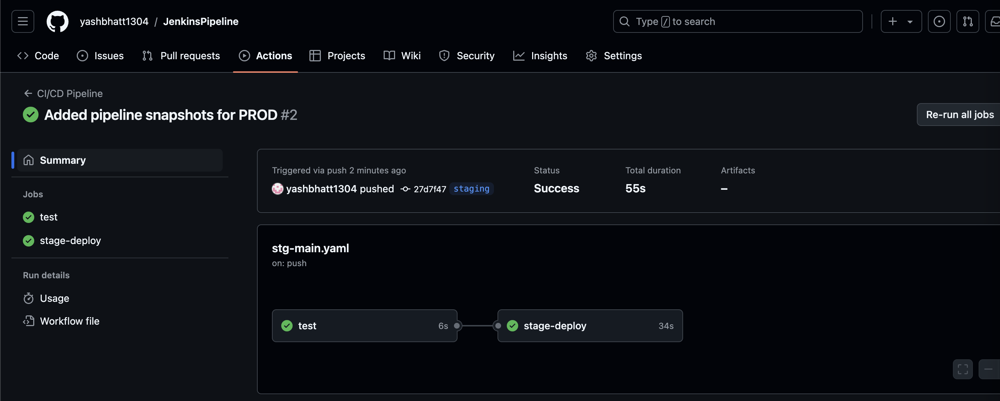
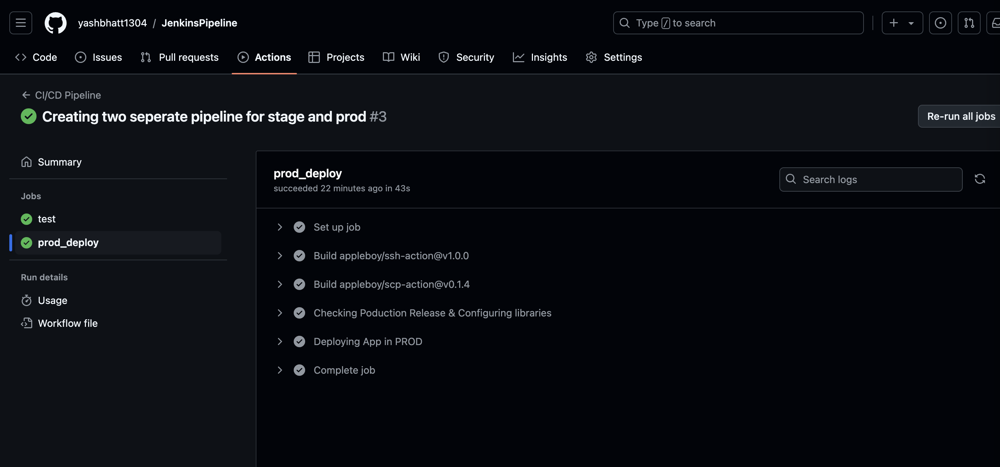

# **CI/CD Pipeline**

## Objective
To Implement a CI/CD workflow using GitHub Actions for a Python application.

## Concepts/Technology/Tool Covered
1. Git & GitHub for Version Control.
2. GitHub Actions for configuring github workflows.
3. Python for developing simple Flask App.
4. AWS EC2.

## Steps
1. Calculator_flask is our simple python application.
> Refer the Calulator_flask folder for app related files and configurations.

2. Create Secret Variable for the GitHub repository having details for our server.

3. The Github Workflow files were in .github/Workflows directory.
4. **main.yml** file contains the application for Production release.
> Whenever there is a release which is tagged.

5. **stg-main.yml** file contains the application for Stage release.
> Whenever there is release in staging branch.

6. **default** file is used for reverse proxy configuring for our application when deployed on EC2 server.

7. Below are the pipeline steps of deploying new Production release.

8. Below are the pipeline steps of deploying new Production release.

## Happy Coding
Thanks for continuing till the End. :)
